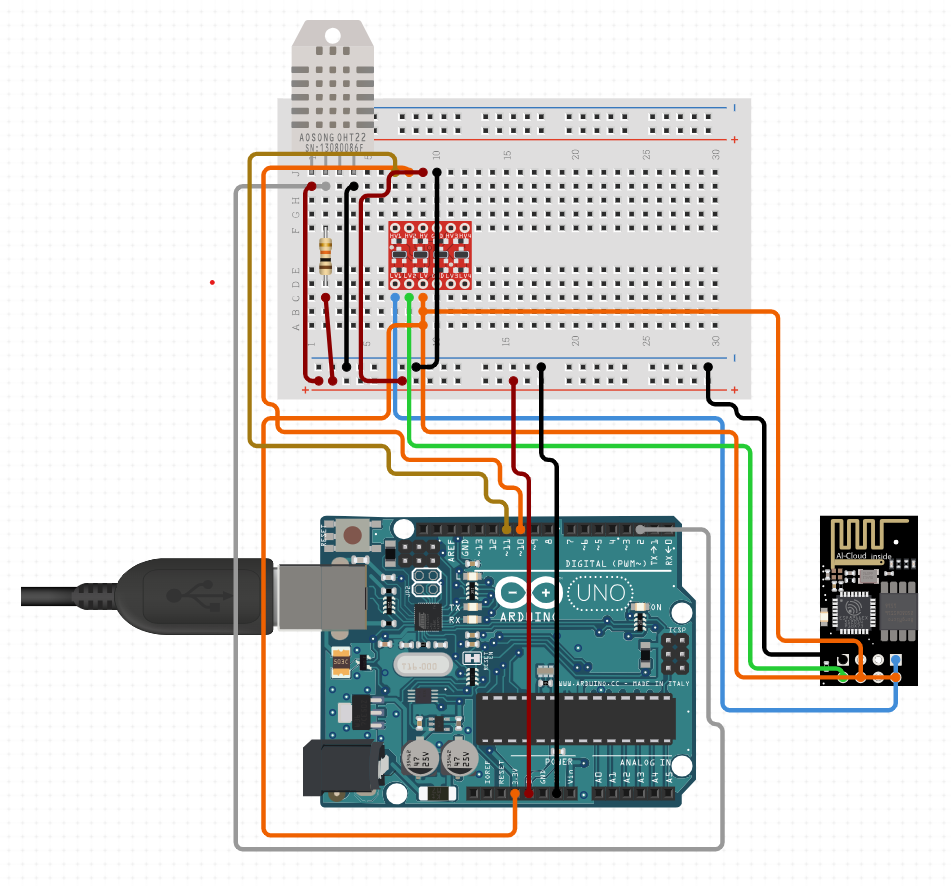

# ESP8266-DHT11-Temperature-Tracker
Arduino-based IoT project aimed at monitoring temperature using a DHT sensor and transmitting the data to a remote server via Wi-Fi using an ESP8266 module.

## Components Required:
 - Arduino Board: Any Arduino board that supports serial communication.
 - ESP8266 Wi-Fi Module: Used for connecting the Arduino to Wi-Fi.
 - DHT Sensor: DHT11 or DHT22 sensor for measuring temperature and humidity.
 - Resistors and Capacitors: Depending on your circuit and ESP8266 module, you may need resistors and capacitors for voltage level shifting and stability.
 - Breadboard and Jumper Wires: For building the circuit on a breadboard and making connections.
 - USB Cable: For connecting the Arduino board to your computer for programming.
 - Power Source: Depending on your project requirements, you may need a power source such as a USB power bank or an AC adapter.

 ## Circuit:

 